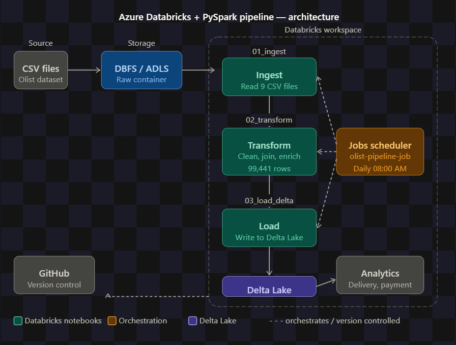

# Azure Databricks + PySpark End-to-End Pipeline

An end-to-end data engineering pipeline built on Databricks, processing the Brazilian E-Commerce (Olist) dataset using PySpark, Delta Lake, and Databricks Jobs Scheduler.

---

## Architecture



The pipeline follows a three-stage medallion-style architecture:

- **Source** — Raw CSV files (Olist dataset, 9 tables) stored in DBFS / ADLS Gen2
- **Ingestion** — PySpark reads and validates raw CSV files into DataFrames
- **Transformation** — Data cleaning, joins, and business logic enrichment
- **Load** — Final dataset written to Delta Lake in optimised format
- **Orchestration** — Databricks Jobs Scheduler runs the pipeline daily at 08:00 AM

---

## Dataset

[Brazilian E-Commerce Public Dataset by Olist](https://www.kaggle.com/datasets/olistbr/brazilian-ecommerce) — a real-world e-commerce dataset containing 100,000+ orders across multiple related tables.

| File | Description | Rows |
|---|---|---|
| olist_orders_dataset.csv | Order master data | 99,441 |
| olist_order_payments_dataset.csv | Payment transactions | 103,886 |
| olist_customers_dataset.csv | Customer profiles | 99,441 |
| olist_order_items_dataset.csv | Order line items | 112,650 |
| olist_products_dataset.csv | Product catalogue | — |
| olist_sellers_dataset.csv | Seller profiles | — |

---

## Pipeline Notebooks

### 01_ingest.py
- Reads all 9 CSV files from DBFS / ADLS raw container
- Validates file accessibility using `dbutils.fs.ls()`
- Loads data into Spark DataFrames with inferred schema
- Verifies row counts and prints schema for each key table

### 02_transform.py
- Drops duplicates and null values on critical columns
- Calculates `delivery_days` using `datediff()` between purchase and delivery timestamps
- Derives `delivery_status` — ON TIME, LATE, or PENDING — based on estimated vs actual delivery
- Aggregates payment data per order (total payment, payment count, average installments)
- Categorises orders into LOW / MEDIUM / HIGH payment tiers
- Joins orders, payments, and customers into a single enriched DataFrame
- Runs data validation assertions to confirm zero null order IDs and no negative payments

### 03_load_delta.py
- Writes the transformed DataFrame to Delta Lake in overwrite mode with schema merging enabled
- Reads back from Delta Lake to verify row count integrity
- Generates summary analytics:
  - Delivery status distribution (ON TIME / LATE / PENDING)
  - Payment category breakdown (LOW / MEDIUM / HIGH)
  - Top 5 states by order volume

---

## Key Results

| Metric | Value |
|---|---|
| Total orders processed | 99,441 |
| On-time deliveries | 88,649 (89.1%) |
| Late deliveries | 7,827 (7.9%) |
| Pending orders | 2,965 (3.0%) |
| Top state by orders | São Paulo (SP) — 41,746 |

---

## Tech Stack

| Layer | Technology |
|---|---|
| Data processing | PySpark (Spark 17.3 LTS) |
| Storage | DBFS / Azure Data Lake Storage Gen2 |
| Data format | Delta Lake |
| Orchestration | Databricks Jobs Scheduler |
| Notebooks | Databricks (Python) |
| Version control | Git / GitHub |
| Cloud | Microsoft Azure |

---

## Project Structure

```
azure-databricks-pyspark-pipeline/
│
├── 01_ingest.py          # Ingestion notebook
├── 02_transform.py       # Transformation notebook
├── 03_load_delta.py      # Delta Lake load notebook
├── architecture.png      # Pipeline architecture diagram
└── README.md
```

---

## How to Run

1. Upload the Olist CSV files to your DBFS volume or ADLS raw container
2. Update the `raw_path` variable in each notebook to match your storage path
3. Run notebooks individually in order: `01_ingest` → `02_transform` → `03_load_delta`
4. Or use the Databricks Jobs Scheduler to run the full pipeline automatically

---

## Orchestration

The pipeline is orchestrated using **Databricks Jobs Scheduler** with three sequential tasks:

```
ingest → transform → load_delta
```

Each task depends on the successful completion of the previous one. The job is scheduled to run daily at 08:00 AM.

---

## Author

**Vishmitha Attanayaka**  
Data Engineer  
[LinkedIn](https://www.linkedin.com/in/vishmitha-attanayaka) | vishmithaattanayaka@gmail.com
